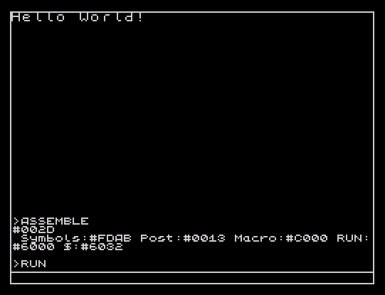

# HELLO WORLD IN ZX-SPECTRUM ASSEMBLER
;ASM:     ALASM v5.07
;CPU:     Zilog Z80, 3.5MHz
;RAM:     48Kb or 128Kb
;SCREEN:  265x192 pixels,
;         32x24 color attributes
;CTRL:    Keyboard and joystick

