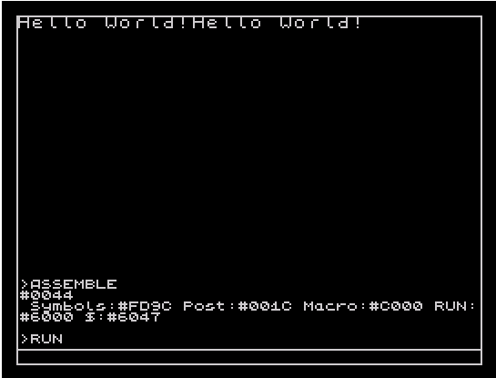

# PASS PARAMETER TO FUNCTION THROUGH STACK
;ASM:     ALASM v5.07 
;CPU:     Zilog Z80, 3.5MHz 
;RAM:     48Kb or 128Kb 
;SCREEN:  265x192 pixels, 
;         32x24 color attributes 
;CTRL:    Keyboard and joystick 
 

