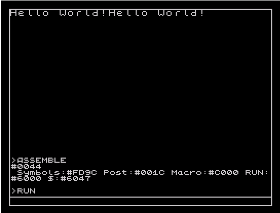
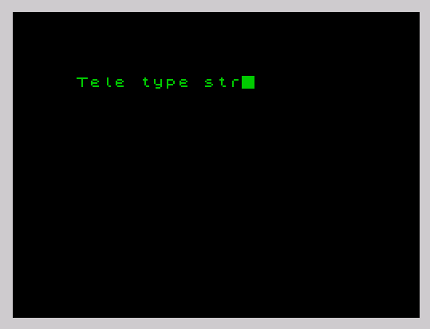
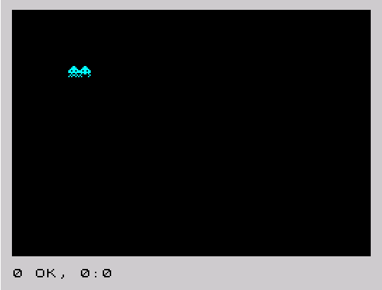

# Изучение ассемблера ZX-Spectrum

## 1. HelloWorld
Простой вывод строки с использованием функции ПЗУ 8252  

## 2. PassParamThroughStack
Небольшой эксперимент с передачей параметров в свою функцию через стек. 
Необходимо помнить, что на вершину стека, при вызове функции, кладется адрес возврата 
и важно его не испортить  

## 3. SetScreenAttribute
Медленная функция установки аттрибутов экрана с использованием функции ПЗУ 16  
 

## 4. FastSetScreenAttribute
Быстрая функция установки аттрибутов при помощи прямой работы с видеопамятью  

## 5. StaticScreen
Вывод красивой рамки при помощи набора символов UDG и функции ПЗУ 8252  

## 6. TeletypeEffect
Эффект телетайпа. Первый эксперимент с использованием прерывания IM2 для реализации функции задержки  

## 7. DrawSprite
Вывод спрайта на экран при помощи прямой работы с видеопамятью  

## 8. AnimatedSprite
Вывод многокадрового спрайта в движении  

## 9. KeyboardControl
Управление спрайтом при помощи клавиш WASD  

## 10. ScoreWorker
Счетчик очков  

